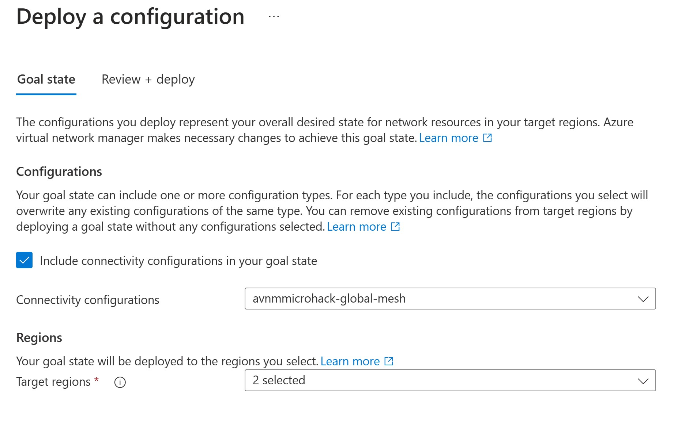
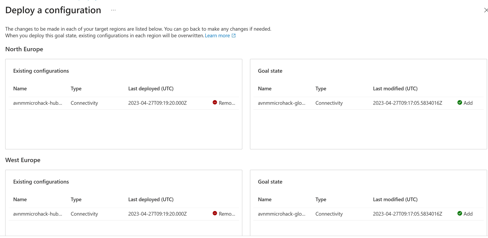

# **Azure Virtual Network Manager MicroHack**

Welcome to the Azure Virtual Manager Microhack

## Contents

[Introduction](#introduction)

[Pre-requisites](#pre-requisites)

[The Microhack Objectives](#objectives)

[Lab Overview](#lab-overview)

[Lab Deployment](#deployment)

[Challenge 1: Create Network groups](#Challenge-1-Create-Network-groups)

[Challenge 2: Create Hub-Spoke topology](#Challenge-2-Create-Hub-Spoke-topology)

[Challenge 3: Create Global Mesh Topology](#Challenge-3-Create-Globalc-Mesh-Topology)

[Challenge 4: Security Admin Configuration](#Challenge-4-Security-Admin-Configuration)

[Cleanup of resources](#Cleanup-of-resources)

[Final Word](#Final-Word)

## Introduction

Azure Virtual Network Manager (AVNM) is a management service that enables you to group, configure, deploy, and manage virtual networks globally across subscriptions. With Virtual Network Manager, you can define network groups to identify and logically segment your virtual networks. Then you can determine the connectivity and security configurations you want and apply them across all the selected virtual networks in network groups at once.

AVNM is a very useful and powerful component within the Azure Networking suite. To manage Azure VNet's at scale in different architecture patterns AVNM should be a core component in the Azure network foundation of any customer.

AVNM key benefits:

- Centrally manage connectivity- and security policies globally across regions and subscriptions.
- Enable direct connectivity between spokes in a hub-and-spoke configuration without the complexity of managing a mesh network.
- Highly scalable and highly available service with redundancy and replication across the globe.
- Ability to create network security rules that override network security group rules.
- Low latency and high bandwidth between resources in different virtual networks using virtual network peering.
- Roll out network changes through a specific region sequence and frequency of your choosing.

AVNM is therefore a great tool to manage topologies like:

- **Hub-Spoke topology** A common deployment pattern recommended when you're deploying central infrastructure services in a hub virtual network that are shared by spoke virtual networks. This topology can be more efficient than having these common components in all spoke virtual networks.  

- **(Global) mesh topology** another common deployment pattern: all virtual networks have direct connectivity with each other. They don't need to go through other hops on the network to communicate. Mesh topology is useful when all the virtual networks need to communicate directly with each other.

But also new concepts are introduced by AVNM:

- **Network Groups** A network group is global container that includes a set of virtual network resources from any region. Then, configurations are applied to target the network group, which applies the configuration to all members of the group. A virtual network can be set to join a network group in multiple ways. The two types are group memberships are *static* and *dynamic* memberships.

- **Direct Connectivity**
Enabling Direct connectivity creates an overlay of a connected group on top of your hub and spoke topology, which contains spoke virtual networks of a given group. Direct connectivity allows a spoke VNet to talk directly to other VNets in its spoke group, but not to VNets in other spokes.
For example, you create two network groups. You enable direct connectivity for the Production network group but not for the Test network group. This set up only allows virtual networks in the Production network group to communicate with one another but not the ones in the Test network group.

- **Security admin rules** A security admin configuration contains a set of rule collections. Each rule collection contains one or more security admin rules. You then associate the rule collection with the network groups that you want to apply the security admin rules to. These security rules have a higher priority than network security group (NSG) rules and will get evaluated before NSG rules. Also note that security admin rules don't change your NSG rules.

- **Virtual Network Manager Scope** Your Network Manager will only have delegated access to apply configurations within a scope boundary. Defining a scope can be done directly on a list of subscriptions. However, it's recommended to use management groups to define your scope. Management groups provide hierarchical organization to your subscriptions.

The purpose of this microhack is it to get familiar and gain hands-on experience with the new Azure Virtual Network Manager (AVNM). Although AVNM is still in public preview, features probably won't be changed.

see [AVNM overview](https://learn.microsoft.com/en-us/azure/virtual-network-manager/overview "AVNM Overview") documentation for more info.

For a deep dive of AVNM I recommend to watch the youtube video from my esteemed colleague John Savill, [Azure Virtual Network Manager Deep Dive](https://youtu.be/qNn83S55WHQ)

## Pre-requisites

Several prerequisites are required:

- To perform this Microhack an Azure subscription is required, if you don't have one, I recommend to start a free Azure subscription with a start credit see [here](https://azure.microsoft.com/en-us/free/search/).
Dont perform these labs in your production environment!

- Having basic knowledge about Azure networking and understanding concepts as Virtual Networks, VNet Peering, Hub-Spoke, mesh patterns, Network Security Groups and security rules as wel as Bastion and VM's is very useful.

- If you run this lab in an existing tenant and subscription, make sure you have permission on that subscription to create Azure policies, this is required to create dynamic network groups.

## Objectives

This MicroHack scenario walks through several Azure Virtual Network Manager scenarios. The objective of this Microhack is to actually deploy an AVNM configuration and perform several challenges such as: creating network groups, deploying Hub-Spoke, Mesh, Hub-Spoke with Direct connectivity and security rules with a new concept as 'Always Allow' rules.

The main objective is that after this Microhack you will be able to:

- Know how to build and deploy several Network topologies with AVNM
- Understand the power of AVNM and how this differs from 'classic' VNet peering
- Understand how Security admin rules can help you maintain a secure foundation in your VNet topology

## Lab Overview

The Lab consists of 6 resource groups; 1 Hub and 5 Spokes. the Hub and Spoke 1 to 3 are deployed in the North-Europe region and Spoke 4 & 5 in the West Europe region.
The Hub RG contains the Hub VNet, an Network Security Group, a Virtual Machine and the Azure Virtual Network Manager.
Also in the hub is an Azure Bastion deployed, to connect secure the Virtual Machines.
All spokes are also deployed with a Virtual Network, a Network Security Group and a Virtual Machine.

## Deployment

### Task 1 - Deploy the lab

We are going to use a predefined Terraform template to deploy the base environment. It will be deployed in to *your* Azure subscription. As stated the locations for this deployment will be in North- and West Europe. If you are savy in Terraform you can alter these in the *variables.tf* file in the parameters *location1* and *location2*.

To start the terraform deployment, follow the steps listed below:

- Login to Azure cloud shell [https://shell.azure.com/](https://shell.azure.com/)
- Ensure that you are operating within the correct subscription via:

`az account show`

If you don't have the right subscription, select the right one with the following command:

`az account set --subscription <Name or ID of subscription>`

- Clone the following GitHub repository

`git clone https://github.com/aramsmith/AVNM-Microhack`

- Go to the new folder AVNM-Microhack

`cd ./AVNM-Microhack`

- Initialize the terraform modules and download the azurerm resource provider by typing the command:

`terraform init`

(If you have used Terraform before, make sure you run `terraform init -update` to initialize version 3.55 which is required as minimum for this microhack).

- Now run apply to start the deployment:

`terraform apply`

- Choose a suitable *password* to be used for your Virtual Machines administrator account.
- Remember the username is: **AzureAdmin**
- When prompted, confirm with a **yes** to start the deployment
- Wait for the deployment to be completed. This will take around 10 minutes.

You can also deploy this through Visual Studio Code by pulling the git repository in your VS Code library and deploy it through the terminal.

### Task 2 - Verify

After the Terraform deployment concludes successfully, the following have been deployed into your subscription:

- 6 resource groups:
  - 1 Hub RG located in *North Europe* region, with A Vnet 10.10.0.0/16 2 subnets, a Virtual Machine and Azure Bastion.
  - 3 Spoke RG's, Spoke 1 to 3 located in *North Europe* region, with corresponding subnets 10.11.0.0/16, 10.12.0.0/16 and 10.13.0.0/16 each of them configured with a Virtual machine.
    - 2 Spoke RG's, Spoke 4 & 5 located in *West Europe* region with corresponding subnets 10.14.0.0/16 and 10.15.0.0/16
  - You can see that every VNet has a tag location:region (either northeurope or westeurope).
    - Verify that there are no peerings between the Hub and spokes or between spokes.

Verify these resources are present in the portal.
Layout should look like this:

Credentials are identical for all VMs, as follows:

- User name: **AzureAdmin**
- Password: *your password* that you have chosen in the deployment.

### Task 3 - Install Azure Virtual Network Manager

The good news is, you dont have to! The Azure Virtual Network Manager or in short Network Manager is already deployed in the Hub RG with the name *avnmmicrohack* and recognizable on the follwing icon:

In the future, when you want to deploy AVNM there are two parameters of importance:

- Select a scope, this can be the subscription or a management group that contains the subscription in which you have deployed the microhack.
- Select Features:
  - Connectivity - This will enable the different topology configurations.
  - Security Admin - This will enable the Security Admin configurations.

## Challenge 1: Create Network groups

within Azure Networking the *Network Group* is a new concept, introduced by AVNM.
A network group is global container that includes a set of virtual network resources from any region. Then, configurations are applied to target the network group, which applies the configuration to all members of the group.

Group membership is a many-to-many relationship, such that one group holds many virtual networks and any given virtual network can participate in multiple network groups. As part of a network group, the virtual network will receive any configurations applied to the group and deployed to the virtual networks region.

A virtual network can be set to join a network group in multiple ways. The two types are group memberships are *static* and *dynamic* memberships.

A static membership means that you manually configure the group by selecting the VNets that need to be added in one group.

Dynamic membership gives you the flexibility of selecting multiple virtual networks at scale if they meet the conditional statements you have defined and based in an Azure Policy. Dynamic membership is useful for scenarios where you have large number of virtual networks, or if membership is dictated by a condition instead of an explicit list (f.i. we will dynamically group vnets that are based in NorthEurope.
  
### Goal

In this challenge we going to create a static network group (Spokes 4 & 5 in West Europe) and a Dynamic group of the hub and spokes (1 to 3) in North Europe.

### Task 1: Static Network Group

- In the Network Manager go to the *Network Groups* section and create a new network group named *SpokeGroupWE*.
- Open the new networkgroup by selecting it and select *Add virtual Networks* under the 'Manually add members' section.

- Add Spoke 4 & Spoke 5 as they are based in West Europe.

#### Result

If you look at the *SpokeGroupWE* network group you will see under the column *Group Members* 2 members. If you click on *GroupMembers* you will see the members *Spoke4-vnet* and *Spoke5-vnet*, and that you manually added them.

### Task 2: Hub Static Network Group

Further in this microhack we will build a Mesh topology, for that we need to have an additional Static Network Group called *Hub* with only the hub network, this enables us to leverage the Bastion functionality in the Mesh topology.

- In the Network Manager go to the *Network Groups* section and create a new network group named *HubGroup*.
- Open the new networkgroup by selecting it and select *Add virtual Networks* under the 'Manually add members' section.
- Add Hub-Vnet as only member.

#### Result

If you look at the *HubGroup* network group you will see under the column *Group Members* 1 member the Hub-Vnet.

### Task 3: Dynamic Network Group

As stated before a Dynamic Network group consist of an Azure policy that adds the Vnets based on a condition or attribute such as name, tag or other. We want to add all spoke VNet's that are located in North Europe to a Network Group, so we define a policy based on name and based on the location tag.

In the Network Manager go to the *Network Groups* section and create a new network group named *SpokeGroupNE*.

Open the new networkgroup by selecting it and select *Create Azure Policy* under the 'Create policy to dynamically add members' section.
Now we want to select all spokes that are located in North Europe but *not* the hub-vnet.

- Provide a name to the policy f.i. *SpokeGroupNEpolicy*
- Select Parameter *Name*,  Operator *Contains* and Condition *Spoke*
- Select *AND* Parameter *Location*, Operator *Equals* and Condition Pnortheurope*

This policy will combine all networks with the word 'Spoke' in their name AND is deployed in the North Europe Region.

- You can check the result by selecting the *Preview Resources*  button and see if the 3 VNets in North Europe will be selected.

- hit *Close* and then *Save*
The Policy will be created.
#### Result

If you look at the *SpokeGroupNE* network group you will see under the column *Group Members* 3 members. If you click on the 3 you will see the members *spoke1-vnet* to *spoke3-vnet*
**If you don't see these member immediately, wait for a few minutes!** (it takes some time before policies apply, hit *refresh* several times).

Finaly the configuration of network groups should look like this:

## Challenge 2: Create Hub-Spoke topology

Hub and spoke topology is recommended when you're deploying central infrastructure services in a hub virtual network that are shared by spoke virtual networks. This topology can be more efficient than having these common components in all spoke virtual networks.

### Goal

In this challenge we going to configure a hub-spoke topology based on the network groups we made in Challenge 1.
After the configuration we will deploy the configuration.

### Task 1: Configure the Hub-Spoke topology

In order to deploy a Hub-Spoke topology we first need to create a configuration.

- In the AVNMMicrohack Network manager select *Configurations*
- Select *Create* and select *Connectivity configuration*
- Provide a name: *avnmmicrohack-hub-spoke*
- Select *Next: Topology*
- Select *Hub and Spoke* option
- Select at *Hub* the *Select a hub* link and select the *hub-vnet*
- At the *Spoke Network Groups* section select *Add*
- Select both *SpokeGroupWE* and *SpokeGroupNE* groups (not the HubGroup)

*Note* You can set here an additional configuration:
|Setting | Description |
|-|-|
|Direct Connectivity| Select the checkbox if you want to enable connectivity *within the network group.* This setting allows spoke virtual networks in the network group in the *same region* to communicate with each other directly.|
|Global Mesh| If you want to be able to enable connectivity between network groups and therefore all spokes in *different regions* aka *full mesh*|
|Hub as gateway| If you have deployed a gateway in the Hub (fi. an Virtual Network gateway for S2S VPN or Express Route), you can enable connectivity from spokes to the Gateway|

In *Visualizations* you can see a nice overview of the configuration.

- Select *Review and create*
#### Result

You should now have in the *configurations* section a configuration with the name *avnmmicrohack-hub-spoke* with the above configuration.
*Be aware that this is just the configuration, you haven't deployed it yet!*

## Task 2: Deploy Hub-Spoke Configuration

Before we deploy the configuration we can proof by a test that there are no peerings.
This can be checked in two ways:
- Check if there are no existing peerings betweemn hub and spokes
- Try to connect with Bastion to spoke VM's which wont work if there are no peerings. 

To check if there are no peering's see the *peerings* section of the *hub-vnet*. This should show no peering's:

Also is we try to connect to spoke1-vm1 through Bastion we don't get a connection.

To deploy the AVNM Hub-Spoke configuration we do the following:
- In Virtual Network Manager, click on *Deployments*
- Select *Deploy Configurations*
- Select Hub and Spoke Configuration - avnmmicrohack-hub-spoke
- Because the Hub & Spoke configuration consists of resources in North- & West Europe please select North and West Europe in the *Target Regions* section

The target configuration should look like this:

- Hit the Deploy button

#### Result
When succesfully deployed it should look like this:

This can be checked by looking at the *Peerings* section in the Hub-Vnet, if deployment was successful you should see the peerings from Hub-Vnet to all other spokes

Now we should also be able to connect from Bastion in the Hub to VM's in the spokes.

**Congrats, you have now dseployed a Hub-Spoke config through Azure Virtual Network Manager!**

## Challenge 3: Create Global Mesh Topology
Next to a Hub-Spoke model is the (Global) Mesh model.
When a mesh topology is deployed, all virtual networks have direct connectivity with each other. They don't need to go through other hops on the network to communicate. Mesh topology is useful when all the virtual networks need to communicate directly with each other.
Mesh networks come in tweo flavors: Mesh, means connectivity between spokes in the same region. Global Mesh means connectivity between all spokes in all regions.

New with Azure Virtual Network Manager is the fact that Mesh networks won't be reflected in network peerings, the Direct Connect and Mesh configuration is maintained at a lower level.

### Goal
In this challenge we going to configure a Global Mesh topology based on the network groups we made in Challenge 1.
After the configuration we will deploy the configuration.
We can change from one to another configuration and deployment.

### Task 1 - Create Global Mesh topology Configuration
In order to deploy a Global Mesh topology we first need to create a configuration.

- In the AVNMMicrohack Network manager select *Configurations*
- Select *Create* and select *Connectivity configuration*
- Provide a name: *avnmmicrohack-global-mesh*
- Select *Next: Topology*
- Select *Mesh* option
- Select *Enable Mesh Connectivity accross Regions*

*By default Mesh connectivity is applied to Virtual Networks in the same region. However you can enable Gobal Mesh by enabling connectivity accross regions.*

- At the *Spoke Network Groups* section select *Add*
- Select All network groups *HubGroup*, *SpokeGroupWE* and *SpokeGroupNE*.

Hit the *Review + Create* button

### Task 2 - Deploy Global Mesh Topology

Although one configuration is deployed, it is possible to change one deployment with a changed or altered deployment.

To deploy the AVNM Global Mesh configuration we do the following:
- In Virtual Network Manager, click on *Deployments*
- Select *Deploy Configurations*
- Select *Connectivity Mesh* Configuration then *avnmmicrohack-global-mesh*
- Because the Mesh configuration consists of resources in North- & West Europe please select North and West Europe in the *Target Regions* section

The target configuration should look like this:

Because there is an existing Hub-Spoke configuration there will be a replacement with the Mesh congfiguration.

In here you can see that the Hub-Spoke config will be replaced with the Global Mesh configuration.

- Hit the *Deploy* button.

#### Result

When successfully deployed it should look like this:

If you look at the peerings from the Hub-Vnet and Spokex-Vnets you will notice these are gone and no peerings exist, although the (global) Mesh connectivity exists.
You can test this by accessing *Hub-VM1* through Bastion and within that server use the Remote Desktop Protocol to establish an RDP connection to the other VM's such as *Spoke1-VM1* 

**Congrats, you have now deployed a Global Mesh config through Azure Virtual Network Manager!**

## Challenge 4: Security Admin Configuration
A security admin Configuration allows you to enforce security policies on resources that match a rule's condition set. For example, you can define a security admin rule to block network traffic to virtual networks over a high-risk port.
These rules only apply to resources within the scope of the Azure Virtual Network Manager instance.

Security admin rules are evaluated before network security rules. Depending on the type of security admin rule you create, they can interact differently with network security group rules. When this happens, organizations can set enforced security policies alongside the teams' network security groups that address their own use cases. 

The order of evaluation of traffic.

There are three kinds of actions – *Allow*, *Always Allow*, and *Deny*. If you create a security admin rule to *Allow* a certain type of traffic, this rule is evaluated first. When a security admin rule allows traffic, it's then evaluated by network security group rules. It leaves room for network security group rules down the line to handle this type of traffic differently as needed. 
If you create a security admin rule to Always Allow or Deny a certain type of traffic, the rule is evaluated first. Then it terminates the network security group evaluation of this traffic – meaning the evaluation is stopped. If the security admin rule is Always Allow, the traffic doesn't hit network security groups, and instead delivers directly to virtual machines or other resource. 

This action can be useful when administrators want to enforce traffic and prevent denial by network security group rules. For example, administrators may want to force the organization to consume software updates from certain ports. When Deny is used, evaluation and therefore traffic is stopped without being delivered to the destination. This means that you can use security admin rules to set definitive security rules that can't be overridden with other rules. Security admin rules don't depend on network security groups in order to exist. This means that administrators can use security admin rules to create default security rules. Even if application owners misconfigured or forgot to establish network security groups, your organization is protected.

### Protect your network against high risk ports
Based on the industry study and suggestions from Microsoft, we recommend customers restrict the traffic from outside using security admin rules for this list of high-risk ports. These ports are often used for the management of resources or unsecure/unencrypted data transmission and shouldn't be exposed to the internet.
For a full list see: [list of high risk ports](https://learn.microsoft.com/en-us/azure/virtual-network-manager/concept-security-admins#protect-high-risk-ports).

### Goal
In this challenge were going to create a Security Admin rule and deployment to prevent port 3389 access in West Europe. 
In order to test this we first need to change the configuration back to a hub-spoke model. Then we test that connection on 3389 is possible. Next we create a Security Admin rule and deploy this to the West Europe spokes.
Then we again test if there is connection on port 3389 possible.

### Task 1: Change network configuration to Hub-Spoke model.
To be able to test the Security Admin configuration we will use Bastion to connect to the Hub-VM1 from *Hub-VM1* we will connect to the *spoke5vm1* through RDP using port 3389.
Because in our last challenge we deployed a global Mesh topology we need to change the deployment back to Hub-Spoke model.
This will also show how easy it is to switch, extend or change the existing topology.
- In Network Manager select *Deployments*
- The current configuration is shown by its *Configuration Name* and should be *avnmmicrohack-global-mesh
- Select *Deploy Configurations* and select *avnmmicrohack-hub-spoke* and select *West Europe* and *North Europe*
- Check the Existing and Target configuration (avnmmicrohack-global-mesh will be removed and avnmmicrohack-hub-spoke will be deployed.)
- Select *Deploy*

### Task 2: Check RDP (3389) connectivity.
To check our Security Admin deployment later, we first need to check RDP connectivity. Perform the following steps:

- In the *avnmmicrohack-hub* resourcegroup Select the *Hub-VM1* VM and click on *Connect*
- Select Bastion, Provide username (AzureAdmin) and your Password (you specified during deployment).
- The browser will open a new tab with the Hub-VM1 desktop.
- Start the *Remote Desktop Connection* application.
- Provide the IP address of the *spoke5-vm1* server (10.15.0.4)
- Select in *Options* and *Display* a resolution of 800x600
- Hit *Connect*

The RDC client will ask for the username and password of the *spoke5-vm1* server (which is the same as for the hub-vm1 server).

#### Result
Result should something like this:

You have made succesfully a connection from the *Hub-VM1* server to the *Spoke5-VM1* server through RDP.

- Close the RDP connection.

### Task 3: Create Security Admin Configuration
The next step is to create a Security Admin Configuration.

- In Network Manager select *Configurations*
- Select *Security Admin Configuration*
- Provide a name for the configuration like *avnmmicrohack-secadmin*
- Hit *Next* and select ad *Rule Collections* select *Add*
- Provide a name for the rule collection like *avnmmicrohack-sa-rc1*
- Select at the *Target Network Groups* only *SpokeGroupWE*
- Next at *Security Admin Rules* select *Add*
- The *Add Rule* blade will emerge.
- Add the following parameters:

- Hit *Add*

You can make additional rules in this ruleset if required.

#### Result
The result should look like this:

- Hit *Add* and *Review and Create*
You can check that in Network Manager *Configurations* an additional *Security - Admin Rules* configuration is added.

### Task 4: Deploy Security Admin Configuration
Next step is to deploy the Security Admin Configuration, like we did with the topology configurations.
To do this:

- In Network Manager go to *Deployments*
- Select *Deploy Configurations*
- Now you will see a thick box named *Inlude Security Admin in your Goal state*
- Mark the box
- In the section *Security Admin Configuration* select the *avnmmicrohack-secadmin* configuration
- In the *Regions* section select only *West Europe*

Configuration should look like this:

- Hit *Next*
- check the deployment goal state and hit *Deploy*

#### Result

When the configuration is deployed it should look like this:

Now we can check if the Security Admin Configuration works, we configured a deny on RDP 3389 protocol incoming on the West Europe Network group and therefore all servers that are located in this network group.

1st check we can do is look at the *Networking* configuration of the *Spoke5-VM1*
This will show us the additional Security Admin Rule that applies to that VM:

You can see the additional deny rule on port 3389.

2nd check is to actually establish an RDP connection.
- We go back to the tab with the *Hub-VM1* desktop
- Open the Remote Desktop Connection app and try to reconnect to the *Spoke5-VM1* (10.15.0.4)
- If the configuration is properly applied the RDP connection cannot be established.

**Congrats, you have now successfully deployed a Security Admin config through Azure Virtual Network Manager!**

## Cleanup of resources
To delete the microhack environment return to the Azure cloud shell

- Login to Azure cloud shell https://shell.azure.com/
- Now run `terraform destroy` to start the destruction of the environment
- After the destruction the *avnmmicrohack-hub* resourcegroup will still exist because the Azure Virtual Network Manager still resides in that group and was not a part of the Terraform Deployment. Please manually delete the resourcegroup.

## Final Word
Thank you for trying the Azure Virtual Network Manager, I made this microhack for fun and in my effort to share knowledge and provide a learning experience. if you have any questions or remarks with regards to the Microhack, please feel free to email me at aram.smith@microsoft.com

Special thanks to my dear friend and colleague [Pieterbas Nagengast](https://github.com/PieterbasNagengast) for updating the TF code and work out some quirks. If you into Network topologies check out his Azure Hub-Spoke [LabBuilder](https://github.com/PieterbasNagengast/Azure-HubSpoke-LabBuilder), (now also with Mesh peering).

Thank you.
